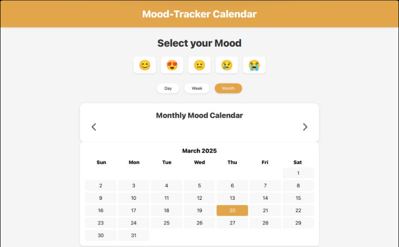

# Mood Tracker Calendar

A simple and intuitive web application that helps users track their daily moods through an interactive calendar interface.

## Features

*   **Daily Mood Tracking**: Record your mood using expressive emojis (😊, 😍, 😐, 😢, 😭)
*   **Multiple View Options**:
    *   Day view: See today's mood
    *   Week view: Track your mood patterns over the week
    *   Month view: Get a monthly overview of your emotional journey
*   **Interactive Calendar**:
    *   Easy navigation between months
    *   Click on dates to add/update moods
    *   Visual indicators for selected moods
*   **Data Persistence**: Saves your mood data locally in the browser
*   **Responsive Design**: Works seamlessly on desktop and mobile devices

## Screenshots

**Monthly Calendar View** 

## Live Demo

Try the application here: [Mood Tracker Calendar](https://mood-tracker-calendar.vercel.app/)

## Technologies Used

*   HTML
*   CSS
*   JavaScript 
*   Local Storage for data persistence

## Local Development

1.  Clone the repository

   git clone https://github.com/yourusername/mood-calendar.git

2. Start tracking your mood.

## License

This project is open source and available under the MIT License.

